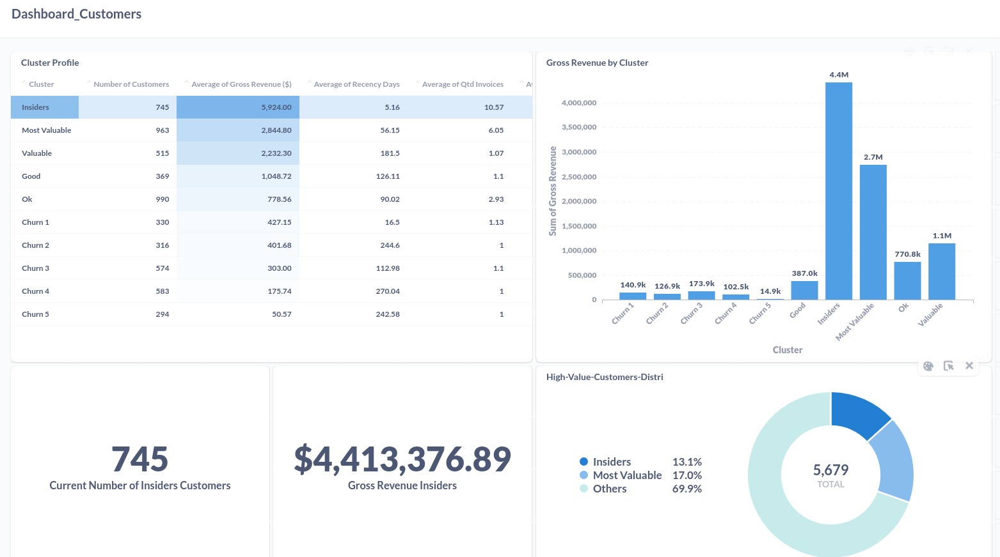
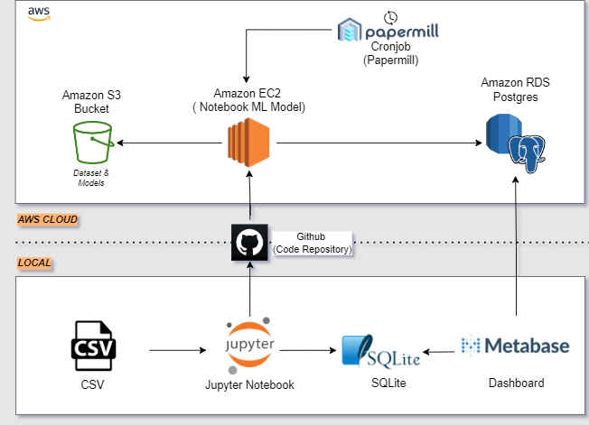

# Insiders program for an e-commerce company
Insiders program project

The following context is entirely fictional, the company, the context and the CEO. The business questions are also fictional, but have been worded to be an example of how they would be asked in a business work environment.

# Introduction
This is a data science clustering project for a company called All In One Place that wants to develop a loyalty program for its most valuable customers based on their purchases.

### Solution Planning

* [1. Description and Business Problem ](#1-description-and-business-problem)
* [2. Business Assumptions](#2-business-assumptions)
* [3. Solution Strategy ](#3-solution-strategy)
* [4. Top Insights ](#4-top-insights)
* [5. Machine Learning Model Selection and Performance](#5-machine-learning-model-selection-and-performance)
* [6. Business Results](#6-business-results)
* [7. Model in Production ](#7-model-in-production)
* [8. Conclusion](#8-conclusion)
* [9. Learning and Future Work](#9-learning-and-future-work)

## 1 Description and Business Problem
## 1.1 Description and context
The All in one Place company is a multi-brand outlet company that sells second line products of various brands at a lower price through e-commerce.

After a little over a year of operation, the marketing team noticed that some of its regular customers were frequently buying more expensive products, contributing a large portion of the company's revenue.

Based on this realization, the marketing team decided to create a loyalty program for the best regular customers called "INSIDERS". Since the marketing team does not have an effective and accurate method to estimate the most valuable customers, the data team was asked to select these insiders using data manipulation and machine learning techniques.

## 1.2 The Challenge and Business Problem

The biggest challenge, then, is to determine which customers are eligible to participate in the "Insider" groups. In possession of this list, the marketing team will run a series of personalized and exclusive promotions for the group to increase sales and purchase frequency, as well as customer satisfaction with the company.

In addition to the creation of this group of Insiders, some business questions must be answered, they are:
* Who are the people eligible to participate in the Insiders program?
* How many customers will be part of the group?
* What are the main characteristics of these customers?
* What is the percentage of revenue contribution from Insiders?
* What is the revenue expectation of this group for the coming months?
* What are the conditions for a person to be eligible for Insiders?
* What are the conditions for a person to be removed from Insiders?
* What is the guarantee that the Insiders program is better than the rest of the base?
* What actions can the marketing team take to increase revenue?

# 2. Business Assumptions
* Invoices where the unit price is less than 0.04 have been removed;
* For the customers without Id, new Id's have been created to maintain their purchase behaviour;
* If the quantity of the items is negative, it means that the item was returned by the customer.
* Invoice numbers with a C in the name were considered as "returned" type invoice.
* Some bad users were deleted due to their strange behaviour and actions that did not make sense.
* Stock codes like 'POST', 'D', 'M', 'PADS', 'DOT', 'CRUK', 'S', 'AMAZONFEE', 'm','DCGSSBOY', 'DCGSSGIRL', 'B' were deleted due to their not explicited  meaning.

# 3. Solution Strategy
### Step 01. Data Description
In this step, some aspects of the data set were checked, such as: Column names, dimensions, data types, verification and completion of missing data (NA), descriptive analysis of the data and what categorical variables exist.

### Step 02. Filtering Variables
Consideration of the need to filter the dataset based on a variable that is not relevant to the project itself. In this step, some previously established business assumptions are considered.

### Step 03. Featuring Engineering
In the Featuring Engineering, new attributes (columns) were derived based on the original variables, which allow for a better description of the phenomenon of the respective variable.

### Step 04. Exploratory Data Analysis (EDA) and Space Study
Exploration of the data to find insights for a better understanding of the company business. Univariate and bivariate analyzes were also performed.

In this step, we also developed a space study to examine how the data is distributed in different spaces. The goal is to choose the best space for clustering customers. At this stage, we decided to use the tree-based embedding space because this space showed the best organization of the data. After this decision, we conducted a short study on feature selection and hyperparameterization of the data space and finished this step.

### Step 05. Data Preparation & Feature Selection
This session is about preparing the data and selecting the best features so that the machine learning algorithms can be applied efficiently.

### Step 06. Hyper Parameter Fine Tuning
In this phase, we applied some specific clustering algorithms and compared their performance using the silhouette metric to check which type of algorithm and which number of "k" (number of groups to be clustered) is ideal for our project. It should be noted that in this case we did not make the selection based only on gross performance, but also took into account the facilitation that this number of groups would bring to the business decision.

### Step 07. Model Training
Creating the selected machine learning model and measuring its performance based on the Sillhouete metric.

### Step 08. Cluster Analysis
The final visualization of the clustered model over the data space and the definition of the profile (attributes) of the clusters created by the model.

### Step 09. Post Profile Data Analysis
Creation of a mind map of business hypotheses and creation and validation of these hypotheses and then answering the business questions that were asked at the beginning of the project and what actions should be recommended to the marketing team.

### Step 10. Model to Deploy Production (AWS)
Planning and implementation of the project's cloud architecture.

# 4. Top Insights

### H3. Customers in the INSIDERS group have a purchase value above 10% of the company's total revenue.

***TRUE*** - The INSIDERS group is responsible for 44.05% of the company's total revenue.

### H4. Customers in the INSIDERS group have a purchase volume of unique products above 10% of the all company.
***TRUE*** - The INSIDERS cluster customer has a purchase volume of unique products of 33%.

### H5. Customers in the INSIDERS group have the AVG of returned products lower than the AVG of the rest of the clusters
***FALSE*** - The Insiders group returns 3.0x more products in comparison the all dataset.

# 5. Machine Learning Model Selection and Performance
The following cluster models were applied in the project:
* KMeans.
* GMM.
* Hierarchical clustering.
* DBScan.

These models were applied with a number of groups (k) from 2 to 22 and the best clustering algorithm was Hierarchical. However, we chose k as 10 because with this number of groups it is possible to have a good performance of the model (silhouette score) and it is easier for the marketing team to create targeted actions for each group with a not so large number of groups.

*The algorithms used to create the embedding spaces were: PCA, UMAP, t-SNE and an embedding based on trees with Random Forest (final space).*

# 6. Business Results

## 6.1 Business Questions and Answers

### Q1. Who are the people eligible to participate in the Insiders program?
R: The people who the algorithm labeled as Insiders.

### Q2. How many customers will be part of the group?
R: Number of Costumers in the INSIDERS Cluster: 745

### Q3. What are the main characteristics of these customers?
R: Characteristics of the Insiders Cluster

Number of Costumers : 745 customers - 13.1% of the total.

Average Gross Revenue: U$5.924,000.

Average Recency Days: 5 days.

Average Quantity of Invoices: 10 invoices (buys).

Average Quantity of items purchase: 3362 items.

Average Quantity of products variety purchased: 239 different products.

Average Frequency of Purchased Products: 0.06

Average quantity of returns: 52 returns.

### Q4. What is the percentage of revenue contribution from Insiders?
R: GMV from Insiders 44.05%

### Q5. What is the revenue expectation of this group for the coming months?
R: This question won't be answered right now because we would need a time series organization to predict the future revenue.

### Q6. What are the conditions for a person to be eligible for Insiders?
R: The model will define for us. So we would need to create a schedule to run the model monthly and then collect the customer and their cluster assignment each month. We would then compare the previous and current cluster assignment so that we know who moved, stayed, or joined the INSIDERS group.

### Q7. What are the conditions for a person to be removed from Insiders?
R: The model will define for us too, just like in the previous question.

### Q8. What is the guarantee that the Insiders program is better than the rest of the base?
R: An A/B Test or a Hypothesis test should be runned on next cycles to answer this question properly

### Q9. What actions can the marketing team take to increase revenue?
There are a few actions that the marketing could use:

* Discount
* Purchase Prefence
* Company Visits
* Exclusive Content
* Free Shipping
* More investment in marketing for some specific groups
* Recommend Cross-Sell

## 6.2 Metabase Dashboard with some information about the Insider's Cluster.

# 7. Model in Production
The final model deployment infrastructure is organized as follows

# 8. Conclusion

# 9. Learning and Future Work
Learning

